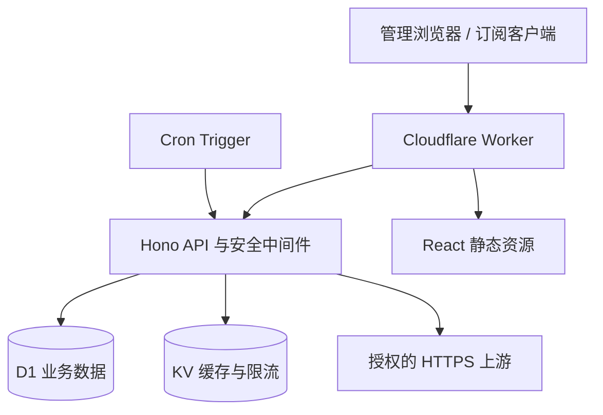

# 系统架构

CloudSub 是单仓库、单 Worker 的全栈应用。Vite 将 React 控制台构建到 `dist/client`，Wrangler 把静态资源与 Hono Worker 作为一个部署单元发布。

## 模块边界

- `src/worker/app.ts`：HTTP 路由、Zod 输入验证和响应映射。
- `src/worker/services`：认证、数据源刷新、订阅生成、审计等业务用例。
- `src/worker/adapters/input`：格式识别、解析和标准化。
- `src/worker/adapters/output`：规则流水线与目标格式渲染。
- `src/worker/security`：密码、令牌、加密与安全拉取。
- `src/worker/db/schema.ts`：Drizzle 表结构；`migrations` 是部署时的权威数据库变更记录。
- `src/dashboard`：只通过 Worker API 访问数据，不直接接触 D1。

## 数据流

数据源刷新先取得加密载荷，再读取手动内容或安全拉取 HTTPS 上游。输入适配器把记录转成统一节点模型并生成稳定指纹。刷新时节点先标记为不在当前快照，随后按 `(source_id, fingerprint)` upsert；管理员的启停和显示名称不会被普通刷新覆盖。

订阅请求先使用 `APP_SECRET` 计算令牌的 HMAC-SHA-256，并完成有效期检查，然后使用 `subscription:{id}:{target}:{revision}` 读取 KV。未命中时从 D1 批量读取节点，依次执行启用、来源、协议/标签/名称过滤、去重、重命名、排序与渲染，并将结果和 ETag 写回 KV。

## 扩展点

新增输入格式应实现独立解析器并接入 `parseSubscriptionContent`；新增输出格式应扩展 `SubscriptionTarget` 和输出适配器。不要在路由中拼装协议配置。
